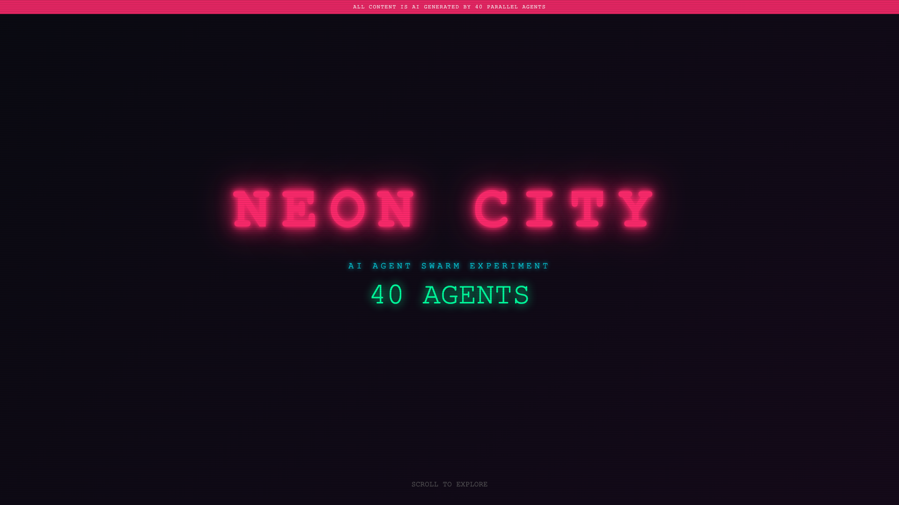

# Neon City

40 AI coding agents ran in parallel, and each one built a single interactive cyberpunk visual: boids, fluid, fractals, Game of Life, metaballs, Voronoi and more. `index.html` is the hub that embeds them, five at a time. `gallery.html` shows pixel-art assets generated with Gemini.



## Run

```sh
python3 serve.py        # opens http://localhost:8888
```

Each experience is one self-contained `experiences/<name>/index.html` with no build step.

## Regenerate assets

```sh
GEMINI_API_KEY=... python3 generate_assets.py
```
